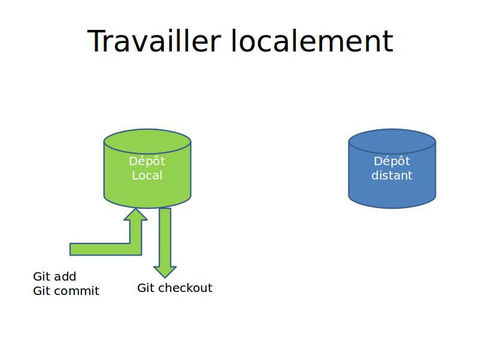
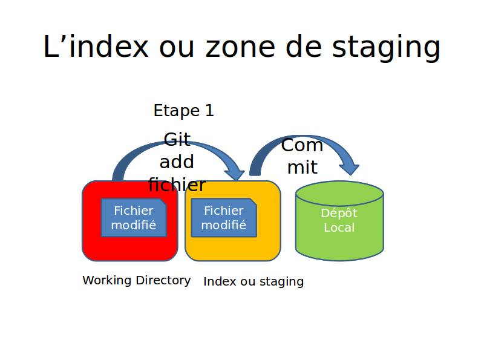
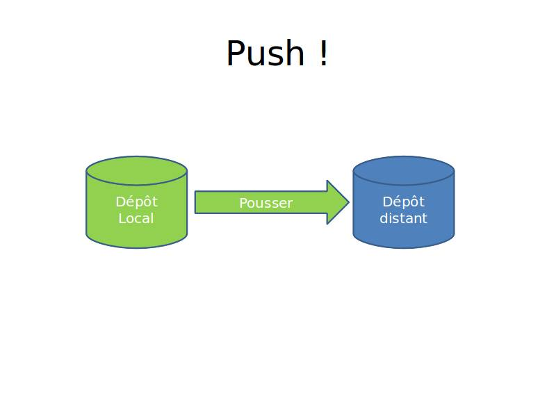
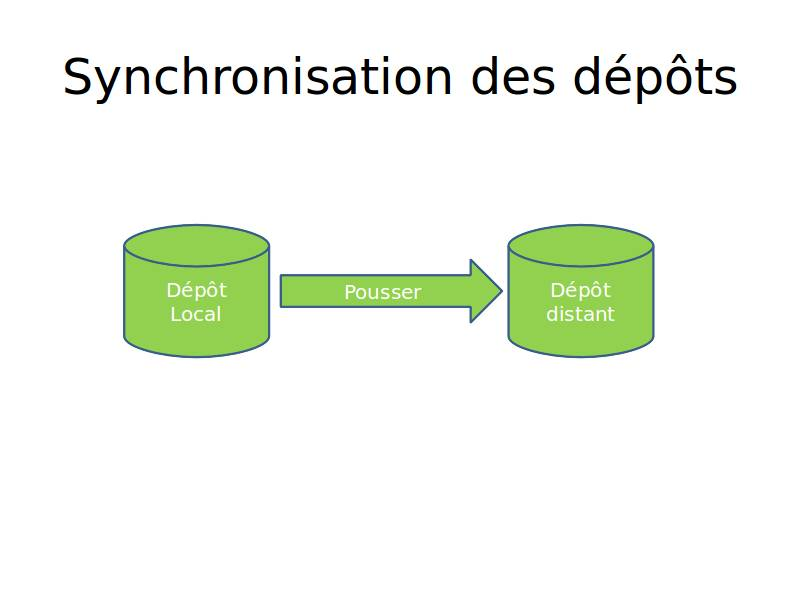
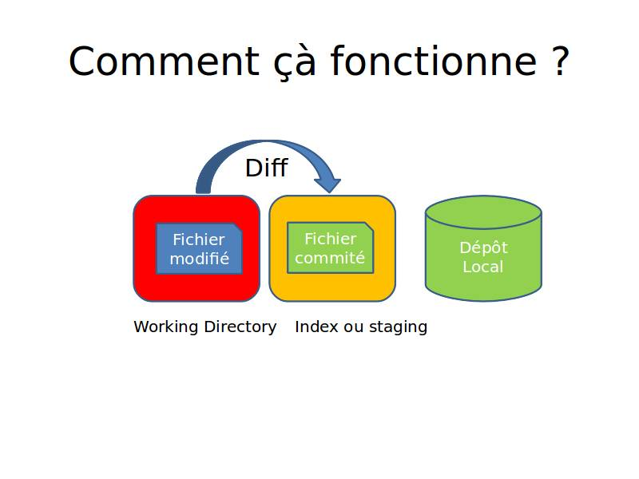
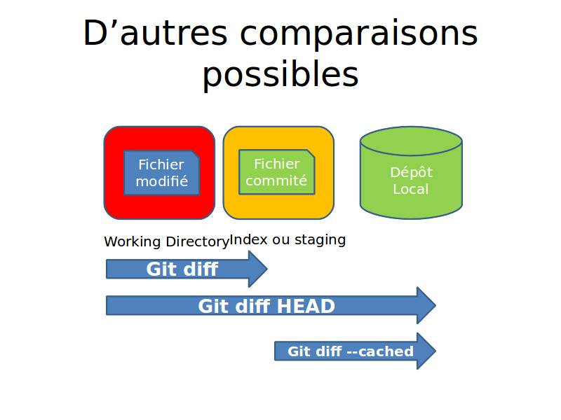
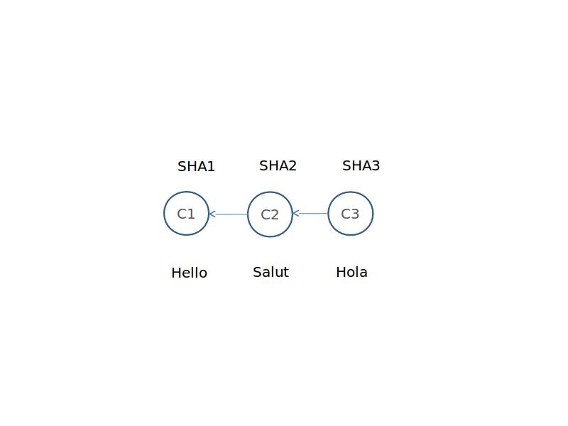

# Git Atelier
## 2013-12-02
Anthony Cassaigne


## Configuration minimale

```shell
git config --global user.name "Prénom Nom"
git config --global user.email mon_email@example.com
```
Pour lister la configuration
```shell
git config --list
```
On peut également éditer le fichier ~`/.gitconfig`


##Cloner un dépôt
[cloner_depot]: images/cloner_depot.jpg  "Optional title attribute"
```shell
git clone http://url/depot.git
```
![Texte][cloner_depot]


# Travailler localement


## Un travail en autonomie



## La gestion de l'index



# C'est lourd !


## Pensez à utiliser
```shell
git gui
```
Il faut un peu de configuration sous OS X


## Pourquoi un index ?

- Pour contrôler ce que l’on commit !
- Pour commiter des ensembles cohérent.
- On peut même commiter une partie de fichier.


## Petit TP

- Modifier un fichier.
- git add
- git commit –m "message de commit"


## Utiliser git status
- Modifier un fichier
```shell
git status
```

- Créer un fichier
```shell
git status
```

- Ajouter à l'index ces deux fichiers et commiter
```shell
git add fichier1 fichier2
git commit -m «message » 
```


# Synchronisation des dépôts


## Commande push
```shell
git push
```



## Les dépôts sont synchronisés



# Commit et quelques commandes utiles


## Identifier un commit
- les commits sont identifiable via les SHA1
```shell
ba74ed1dae5d2b25618f0a8a43a57218c432da46
```
C'est un peu long la plupart du temps il suffit d'utiliser la forme courte

```shell
ba74ed1
```


## Explorer l'historique
quelques commandes à tester donnant une mise en forme différente.
```shell
git log
git log --pretty=oneline
git log --pretty=oneline --abbrev-commit
git log --pretty=oneline --abbrev-commit --decorate
```


## Deux options utile
L'option --stat
```shell
git log --stat
...
 blog/Sandro_Mancuso_SCPPP.rst | 17 ++++++++---------
 draft/pelican.rst             | 18 ++++++++++++++++++
 2 files changed, 26 insertions(+), 9 deletions(-)

```

donne des statistiques en nombre de lignes supprimées et ajoutées
pour chaque fichier (texte) du commit.

L'option `-p` donne les parties du fichier qui sont modifiés.


## Comment récuperer une ancienne version du fichier
Voir le contenu d'un fichier à une version donnée :
```shell
git show SHA1:./filename.txt
```

Pour obtenir cette version il faut utiliser la commande `checkout`
```shell
git checkout SHA1 filename.txt
```

Vous souhaitez obtenir ce fichier avec un autre nom ?
```shell
git show SHA1:./filename.txt > toto.txt
```


# GIT DIFF


## Petit TP 1/3
- Partir sur un dépôt dont la commande git status retourne
```ini
On branch master
Your branch is ahead of 'origin/master' by 1 commit.
  (use "git push" to publish your local commits)
nothing to commit, working directory clean
```

Que donne la commande
```shell
git diff
```
# ?


## Suite TP 2/3
Modifier un fichier, que donne la commande
```shell
git diff
```

# ?


## Suite TP 3/3
Mettre le fichier dans l'index ou la zone de staging
```shell
git add
```

Que donne la commande
```shell
git diff
```

# ?


## Quelques explications 1/2



## Quelques explications 2/2



## Comparer deux versions d'un fichier
```shell
git diff C1 C2
```
Est différent de
```shell
git diff C2 C1
git diff 7904654 62d62b0
```




## git diff commit1 commit2
Cette commande
```shell
git diff 7904654 62d62b0
```
Donne les différences sur tous les fichiers appartenant aux commits.

Si l'on ne veut comparer qu'un fichier
```shell
git diff 7904654 62d62b0 filename.txt
```


## tooldiff un peu plus d'ergonomie

Pour cela il nous faut configurer l'usage de notre outil préféré.
Exemple de configuration sous windows.
```ini
[diff]
    tool = winmerge

[difftool "winmerge"]
    cmd = "winmerge.sh \"$LOCAL\" \"$REMOTE\""

[difftool]
  prompt = false

```
