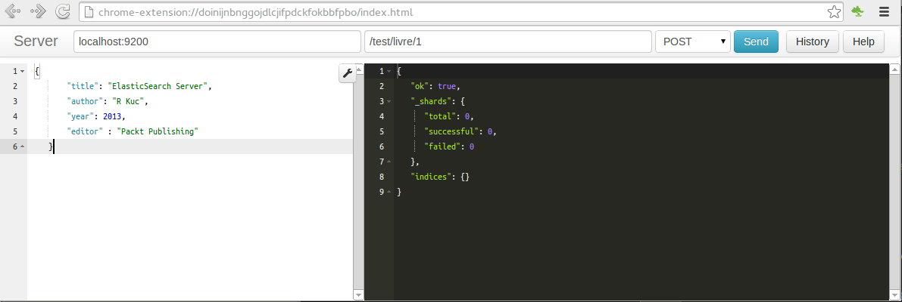

**************
Elastic Search
**************

:date: 2013-09-10 10:20
:tags: NoSQL, ElasticSearch
:category: NoSQL
:slug: intro_es_01
:author: Anthony Cassaigne
:summary: Introduction à ElasticSearch première partie

.. _ElasticSearch: http://www.elasticsearch.org/
.. _SOLR: http://lucene.apache.org/solr/

ElasticSearch_ est le "petit" nouveau des moteurs de recherches. Il s'affiche comme étant un concurrent direct du vénérable SOLR_.

Au cours de cette introduction nous parcourrons les points suivants : installation, création d'index implicite, interrogation, création de mapping, indexation de documents ainsi quelques commandes d'administration.

Installation
============

.. _Télécharger ElasticSearch: http://www.elasticsearch.org/download

Pour l'installation c'est fort simple il suffit de télécharger le fichier zip à cette adresse `Télécharger ElasticSearch`_.

Décompresser l'archive et pour lancer le moteur de recherche utiliser ces commandes :

.. code-block:: shell

  cd elasticsearch-0.90.3\bin
  elasticsearch.bat

Attendre quelques secondes que ElasticSearch démarre et ensuite vous disposez d'un moteur de recherche accessible via cette url http://localhost:9200

Si vous utilisez cette url, vous devez obtenir ce type de message :

.. code-block:: json

    {
    "ok" : true,
    "status" : 200,
    "name" : "John Ryker",
    "version" : {
    "number" : "0.90.3",
    "build_hash" : "5c38d6076448b899d758f29443329571e2522410",
    "build_timestamp" : "2013-08-06T13:18:31Z",
    "build_snapshot" : false,
    "lucene_version" : "4.4"
    },
    "tagline" : "You Know, for Search"
    }

Pour obtenir plus d'informations sur l'état du moteur ElasticSearch vous pouvez utiliser cette URL http://localhost:9200/_stats par contre la réponse n'est pas facilement lisible.

.. _plugin sens: https://chrome.google.com/webstore/detail/sense/doinijnbnggojdlcjifpdckfokbbfpbo

Vous aurez compris que les réponses retournées le sont au format JSON. Dans le cadre de tests ou d'écriture de requêtes permettant de valider un développement, je vous conseil d'utiliser le `plugin sense`_ sous le navigateur Chrome. Pour le moins la mise en forme du JSON réalisée par ce plugin permet une bien meilleur lisibilité.

Ce plugin permet également d'envoyer tout type de requête PUT, POST, GET, DELETE avec ou sans données Json.

Exemple d'utilisation du plugin sens.

Utilisation d'ElasticSearch
===========================

Passons aux choses sérieuses et commençons pas indexer des éléments.
Au travers de cette article nous considérons que nous réalisons un 
projet pour une bibliothèque souhaitant se doter d'un moteur de recherche.
Nos exemples portent donc sur l'indexation de livres. Un livre ayant au moins
pour attributs : un titre (title), un auteur (author), une année de publication (year), un éditeur (editor)

Indexer un élément
------------------

En utilisant l'url ::

  http://localhost:9200/livres/livre/1

en mode "PUT" envoyer le code json 

.. code-block:: json

    {
        "title": "ElasticSearch Server",
        "author": "R Kuc",
        "year": 2013,
        "editor" : "Packt Publishing"
    }

Pourquoi cette forme d'url ?

En réalité livres/livre/id représente le nom_index/type/id
La forme d'url est donc ::

    http://server:9200/<index>/<type>/<id>

Pour mettre à jour ce premier livre envoyer le code json présent ci-dessous à l'url suivante ::

    http://localhost:9200/livres/livre/1 

Code json à envoyer (PUT) pour indexer un livre.

.. code-block:: json

    {
        "title": "ElasticSearch Server",
        "author": "R Kuc",
        "year": 2013,
        "editor" : "Packt Publishing",
        "type" : "computer science",
        "tags" : ["search", "engine"]
    }

Nous venons d'ajouter deux champs type et tags.

En retour nous obtenons 

.. code-block:: json

    {
       "ok": true,
       "_index": "livres",
       "_type": "livre",
       "_id": "1",
       "_version": 2
    }

Pour obtenir un livre utiliser la méthode "GET" :
Il suffit d'utiliser l'url suivante, c'est à dire celle utiliser lors de
l'enregistrement du livre.
http://localhost:9200/livres/livre/1

Le résultat obtenu est 

.. code-block:: json

    {
       "_index": "livres",
       "_type": "livre",
       "_id": "1",
       "_version": 2,
       "exists": true,
       "_source": {
          "title": "ElasticSearch Server",
          "author": "R Kuc",
          "year": 2013,
          "editor": "Packt Publishing",
          "type": "computer science",
          "tags": [
             "search",
             "engine"
          ]
       }
    }

On ne peut pas obtenir une ancienne version. Voir cette resource :

- http://stackoverflow.com/questions/8218309/can-we-retrieve-previous-source-docs-with-elastic-search-versions

Effectuer des recherches
------------------------

Rechercher sur tous les champs

Toute interrogation se fait en JSON exemple d'interrogation sur le mot 'automate'

.. code-block:: json

    {
        "query": {
            "query_string": {
                "query": "automate"
            }
        }
    }

La recherche est lancée sur tous les champs.
Pour lancer cette recherche positionnez vous en mode POST et avec le suffix
_search

Efectuer une recherche sur un ou plusieurs champs
-------------------------------------------------

La syntaxe est la suivante 

.. code-block:: json 

    {
        "query": {
            "query_string": {
                "query": "automate",
                "fields": ["title"]
            }
        }
    }

Indexer des documents word, pdf
===============================

Pour cela il convient d'installer un pluging. Voici la commande à utiliser

.. code-block:: shell

   plugin.bat -install elasticsearch/elasticsearch-mapper-attachments/1.9.0

La commande plugin.bat se trouve dans le répertoire où est installé elasticsearch
plus exactement dans le sous répertoire bin.

- https://gist.github.com/lukas-vlcek/1075067
- http://elasticsearch-users.115913.n3.nabble.com/How-to-create-index-for-a-attachment-of-pdf-by-using-elasticsearch-river-couchdb-1-2-0-don-t-have-an-td4036763.html

création index
lancer simplement un requête PUT sur l'adresse http://localhost:9200/pdf

Mappings
========

Création d'un mapping pour un index inexistant ayant par exemple
pour nom test_index_1.

Pour cela lancer la requête PUT sur l'adresse http://localhost:9200/test_index_1 

.. code-block:: json

  {
    "mappings":
    {
      "person" : {
          "properties" : {
              "my_attachment" : {
                  "type" : "attachment",
                  "fields" : {
                      "file" : { "store" : "yes", "index" : "analyzed"},
                      "content_type" : {"store" : "yes"}
                      }
                  }
          }
      }
    }
  }

Identifier un mapping
---------------------

Pour identifier un mapping lancer une requête GET sur
l'adresse http://localhost:9200/index_name/type/_mapping
Par exemple pour connaitre le mapping du type personne de l'index annuaire on
lancera une requête GET sur l'adresse suivante :

- http://localhost:9200/annuaire/personne/_mapping

Attacher un fichier
-------------------

Installer plugin mapper-attachments
+++++++++++++++++++++++++++++++++++

Pour cela utiliser la commande suivante ::

  bin/plugin -install elasticsearch/elasticsearch-mapper-attachments/1.9.0.

Consulter l'url suivante https://github.com/elasticsearch/elasticsearch-mapper-attachments

Après installation arrêter et relancer ES.

Vous devez avoir un message de ce type dans les logs lors du démarrage de ES ::

    [2013-08-28 16:20:18,803][INFO ][plugins                  ] [Headlok] loaded [mapper-attachments], sites []

Ce message nous informe que le plugin mapper-attachments est bien chargé.

Définir le mapping adéquat
++++++++++++++++++++++++++

Supponsons que nous souhaitions stocker des articles de recherche.
Ces articles sont à stocker sur l'index recherche.
Pour cela il faut créer le mapping suivant, en supposant que les fichiers
à stocker et à indexer sont des articles de recherche. 

.. code-block:: json

  {
    "mappings":
    {
      "article" : {
          "properties" : {
              "mon_fichier" : {
                 "type" : "attachment"
               }
          }
      }
    }
  }

Nous créons ce mapping sur l'index recherche en lançant une requête PUT sur
l'adresse http://localhost:9200/recherche. Lorsque nous définisons un mapping,
il y a implicitement création de l'index. Cela signifie que nous ne pouvons pas
lancer ce type de requête sur un index existant.

Vérifions que le mapping est correct en lançant une requête GET sur l'adresse
http://localhost:9200/recherche/article/_mapping

Nous devons obtenir ceci 

.. code-block:: json

    {
       "article": {
          "properties": {
             "mon_fichier": {
                "type": "attachment",
                "path": "full",
                "fields": {
                   "mon_fichier": {
                      "type": "string"
                   },
                   "author": {
                      "type": "string"
                   },
                   "title": {
                      "type": "string"
                   },
                   "name": {
                      "type": "string"
                   },
                   "date": {
                      "type": "date",
                      "format": "dateOptionalTime"
                   },
                   "keywords": {
                      "type": "string"
                   },
                   "content_type": {
                      "type": "string"
                   },
                   "content_length": {
                      "type": "integer"
                   }
                }
             }
          }
       }
    }

Il est maintenant possible de stocker les fichier dans le champ mon_fichier.
Attention le stockage doit s'effectuer au format base 64.

Stockage fichier texte
++++++++++++++++++++++

Soit le fichier test.txt contenant ce texte ::

  Article de recherche sur les imprimantes.

ce qui nous donne avec un encode base 64 ceci ::

  QXJ0aWNsZSBkZSByZWNoZXJjaGUgc3VyIGxlcyBpbXByaW1hbnRlcy4K

.. note:: pour obtenir cet encodage j'ai utilisé la commande base64 sous linux
          base64 test.txt

Pour stocker ce fichier il suffit donc de lancer une requête PUT à l'adresse
http://localhost:9200/recherche/article/1
dont le contenu est 

.. code-block:: json

  {
   "mon_fichier" : "QXJ0aWNsZSBkZSByZWNoZXJjaGUgc3VyIGxlcyBpbXByaW1hbnRlcy4K"
  }

Recherche sur le contenu
++++++++++++++++++++++++

Il suffit de lancer la requête GET avec ce contenu 

.. code-block:: json

    {

       "query" : {
          "text" : {
             "mon_fichier" : "imprimante"
          }
       }
    }

Pour les langues voir http://stackoverflow.com/questions/7406692/multilingual-queries-in-elasticsearch 

.. code-block:: json

  {
      "mappings": {
      "person" : {
          "properties" : {
              "my_attachment" : {
                  "type" : "attachment",
                  "fields" : {
                      "my_attachment" : { "store" : "yes", "index" : "analyzed","index_analyzer":   "french","search_analyzer": "french"  },  
                      "content_type" : {"store" : "yes"}  
                      } 
                  } 
          } 
      } 
      }
  }

Administration
==============

Obtenir le mapping
------------------

Pour cela utiliser la commande ::

  curl -XGET 'http://localhost:9200/my_index/type/_mapping'

Statistiques d'utilisation
--------------------------

Obtenir les statistiques d'utilisation ::

  curl localhost:9200/_stats
  curl localhost:9200/index1,index2/_stats

Supprimer un index
------------------

Il suffit de poster la commande ::

 curl -XDELETE 'http://localhost:9200/mon_index/'

Rendre  indisponible un index
-----------------------------

utiliser cette commande ::

  curl -XPOST 'localhost:9200/my_index/_close'
  curl -XPOST 'localhost:9200/my_index/_open'

Configurer un index
-------------------

Utiliser les commandes de ce type ::

    curl -XPUT 'localhost:9200/my_index/_settings' -d '
    {
        "index" : {
            "number_of_replicas" : 4
        }
    }
    '

Comment restreindre ou filtrer des ordres/requêtes
---------------------------------------------------

Pour cela il faut utiliser le pluging jetty.
Voir à cette adresse https://github.com/sonian/elasticsearch-jetty
Lire également cet article de blog http://dev.david.pilato.fr/?p=241

Outils
======

Plugin pour chrome `sense` : https://chrome.google.com/webstore/detail/sense/doinijnbnggojdlcjifpdckfokbbfpbo

Ressources Elastic Search
=========================

Livres
------

- http://stackoverflow.com/questions/11593035/beginners-guide-to-elasticsearch

Tutorial
--------

- http://joelabrahamsson.com/elasticsearch-101/

Comparaison solr et ES
----------------------

- http://blog.sematext.com/2012/10/30/solr-vs-elasticsearch-part-4-faceting/

