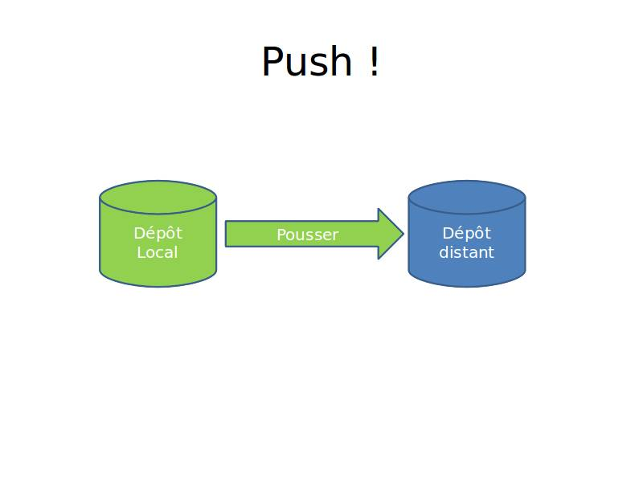

# Git Atelier
## 2013-12-02
Anthony Cassaigne


## Configuration minimale

```shell
git config --global user.name "Prénom Nom"
git config --global user.email mon_email@example.com
```
Pour lister la configuration
```shell
git config --list
```
On peut également éditer le fichier ~`/.gitconfig`


##Cloner un dépôt
[cloner_depot]: images/cloner_depot.jpg  "Optional title attribute"
```shell
git clone http://url/depot.git
```
![Texte][cloner_depot]


##Cloner un dépôt via ssh
- En indiquant un chemin absolut.
```shell
git clone ssh://gituser@little/home/gituser/anthony_atelier
```
- En indiquant un chemin relatif.
```shell
git clone gituser@little:anthony_atelier
```
### Attention le prefix ssh n'existe pas dans ce cas !


# Travailler localement


## Un travail en autonomie
²


## La gestion de l'index


# C'est lourd !


## Pensez à utiliser
```shell
git gui
```
Il faut un peu de configuration sous OS X


## Pourquoi un index ?

- Pour contrôler ce que l’on commit !
- Pour commiter des ensembles cohérent.
- On peut même commiter une partie de fichier.


## Petit TP
- Modifier un fichier et utiliser ces commandes.
```shell
git add
git commit –m "message de commit"
```


## Utiliser git status
- Modifier un fichier
```shell
git status
```

- Créer un fichier
```shell
git status
```

- Ajouter à l'index ces deux fichiers et commiter
```shell
git add fichier1 fichier2
git commit -m "message"
```


# Synchronisation des dépôts


## Commande push
```shell
git push
```



## Les dépôts sont synchronisés


# Commit et quelques commandes utiles


## Identifier un commit
- les commits sont identifiable via les SHA1
```shell
ba74ed1dae5d2b25618f0a8a43a57218c432da46
```
C'est un peu long la plupart du temps il suffit d'utiliser la forme courte

```shell
ba74ed1
```


## Explorer l'historique
quelques commandes à tester donnant une mise en forme différente.
```shell
git log
git log --pretty=oneline
git log --pretty=oneline --abbrev-commit
git log --pretty=oneline --abbrev-commit --decorate
```


## Deux options utile
L'option --stat
```shell
git log --stat
...
 blog/Sandro_Mancuso_SCPPP.rst | 17 ++++++++---------
 draft/pelican.rst             | 18 ++++++++++++++++++
 2 files changed, 26 insertions(+), 9 deletions(-)

```

donne des statistiques en nombre de lignes supprimées et ajoutées
pour chaque fichier (texte) du commit.

L'option `-p` donne les parties du fichier qui sont modifiés.


## Comment récuperer une ancienne version du fichier
Voir le contenu d'un fichier à une version donnée :
```shell
git show SHA1:./filename.txt
```

Pour obtenir cette version il faut utiliser la commande `checkout`
```shell
git checkout SHA1 filename.txt
```

Vous souhaitez obtenir ce fichier avec un autre nom ?
```shell
git show SHA1:./filename.txt > toto.txt
```


# GIT DIFF


## Petit TP 1/3
- Partir sur un dépôt dont la commande git status retourne
```ini
On branch master
Your branch is ahead of 'origin/master' by 1 commit.
  (use "git push" to publish your local commits)
nothing to commit, working directory clean
```

Que donne la commande
```shell
git diff
```
# ?


## Suite TP 2/3
Modifier un fichier, que donne la commande
```shell
git diff
```

# ?


## Suite TP 3/3
Mettre le fichier dans l'index ou la zone de staging
```shell
git add
```

Que donne la commande
```shell
git diff
```

# ?


## Quelques explications 1/2


## Quelques explications 2/2


## Comparer deux versions d'un fichier
```shell
git diff C1 C2
```
Est différent de
```shell
git diff C2 C1
git diff 7904654 62d62b0
```


## git diff commit1 commit2
- Cette commande
```shell
git diff 7904654 62d62b0
```
- Donne les différences sur tous les fichiers appartenant aux commits.
- Si l'on ne veut comparer qu'un fichier
```shell
git diff 7904654 62d62b0 filename.txt
```


## tooldiff un peu plus d'ergonomie

Pour cela il nous faut configurer l'usage de notre outil préféré.
Exemple de configuration sous windows.
```ini
[diff]
    tool = winmerge

[difftool "winmerge"]
    cmd = "winmerge.sh \"$LOCAL\" \"$REMOTE\""

[difftool]
  prompt = false

```


# Git quelques bonus...


## shortcut pour git add !

```shell
   git add -all
```

Ajouter toutes les modifications et commité !
```shell
git ci -a -m "Message de commit"
```

## Annuler...
### Retirer un fichier de l'index
```shell
git reset --hard HEAD
```

### Annuler toutes les modifications!
## ATTENTION PERTE DE DONNEES
```shell
git reset --hard HEAD
```


## Rechercher
Au sein des messages de commit ::
```shell
git log --grep "<PATTERN>"
```

Chercher au sein du code ::
```shell
git log --stat -G'STRING'
git log -p -S'STRING'
```

## Chercher une chaine de caractères effacée
Chercher une chaine de caractère qui a été effacé au sein du code.
```shell
 git log -p -S'STRING' --diff-filter=D
```

Chercher dans les fichiers du répertoire de travail mais uniquement pour les fichiers sous révision
  ```shell
  git grep -e 'STRING'
  ```

## Le grep pour les fichiers sous révision
Chercher dans les fichiers du répertoire de travail mais uniquement pour les fichiers sous révision
```shell
git grep -e 'STRING'
```

Chercher uniquement dans les fichiers ayant l'extension .c
```shell
git grep -e 'STRING' -- '*.c'
```

Chercher au sein des fichiers stockés dans l'index
```shell
git grep --cached -e 'STRING' -- '*.c'
```

## Bonus branche 
- Copier une branche 
```shell
git branch copie_branche branche_existante
```
- Pour créer une branche sur un ancien commit 
```shell
git branch ma_branche 96a31f2314c091121996
```


## Les Tags

positionner un tag sur le commit courant

 ```shell
  git tag mon_tag
  ```

Voir les tags

```shell
git tag -n
```

le -n donne le message associé.

la liste des tags avec le SHA1 ::

```shell
git show --summary --oneline --decorate
```


#Amélioration de l'environnement...


## Un prompt sympa et pratique
```shell
########################################################################
# Matthew's Git Bash Prompt
########################################################################
        RED="\[\033[0;31m\]"
     YELLOW="\[\033[0;33m\]"
    GREEN="\[\033[0;32m\]"
       BLUE="\[\033[0;34m\]"
  LIGHT_RED="\[\033[1;31m\]"
LIGHT_GREEN="\[\033[1;32m\]"
      WHITE="\[\033[1;37m\]"
 LIGHT_GRAY="\[\033[0;37m\]"
 COLOR_NONE="\[\e[0m\]"

function parse_git_branch {
  git rev-parse --git-dir &> /dev/null
  git_status="$(git status 2> /dev/null)"
  branch_pattern="^# On branch ([^${IFS}]*)"
  remote_pattern="# Your branch is (.*) of"
  diverge_pattern="# Your branch and (.*) have diverged"

  if [[ ! ${git_status}} =~ "working directory clean" ]]; then
    state="${RED}⚡"
  fi
  # add an else if or two here if you want to get more specific
  if [[ ${git_status} =~ ${remote_pattern} ]]; then
    if [[ ${BASH_REMATCH[1]} == "ahead" ]]; then
      remote="${YELLOW}↑"
    else
      remote="${YELLOW}↓"
    fi
  fi
  if [[ ${git_status} =~ ${diverge_pattern} ]]; then
    remote="${YELLOW}↕"
  fi
  if [[ ${git_status} =~ ${branch_pattern} ]]; then
    branch=${BASH_REMATCH[1]}
    echo " (${branch})${remote}${state}"
  fi
}

function git_dirty_flag {
  git status 2> /dev/null | grep -c : | awk '{if ($1 > 0) print "⚡"}'
}

function prompt_func() {
    previous_return_value=$?;
    #The lowercase w is the full current working directory
    #prompt="${TITLEBAR}${BLUE}[${RED}\w${GREEN}$(parse_git_branch)${BLUE}]${COLOR_NONE}"

    #Capital W is just the trailing part of the current working directory
    prompt="${TITLEBAR}${BLUE}[${RED}\W${GREEN}$(parse_git_branch)${BLUE}]${COLOR_NONE}"

    if test $previous_return_value -eq 0
    then
        PS1="${prompt}> "
    else
        PS1="${prompt}${RED}>${COLOR_NONE} "
    fi
}

PROMPT_COMMAND=prompt_func
```


## Autre ressources pour un prompt
- simple
* http://blog.deadlypenguin.com/blog/2013/10/24/adding-git-status-to-bash/
- plus évolué
 * https://coderwall.com/p/ib2bpw
 * http://www.git-attitude.fr/2013/05/22/prompt-git-qui-dechire/


## Autre piste oh-my-zsh !!!!
- A regarder.
 * https://github.com/robbyrussell/oh-my-zsh


##Bon le git add c'est lourd !
- Essayons git number
* https://github.com/holygeek/git-number


##Installation git number
```shell
git clone https://github.com/holygeek/git-number
cd git-number
cp git-* ~/bin
vi ~/.bashrc
# alias
alias gn='git number --column'
alias ga='git number add'
```


#Les branches


##Création d'une branche
```shell
git branch ma_branche
```
- Maintenant il faut travailler dans la branche
```shell
git checkout ma_branche
```


## Merge d'une branche
- merge de la branche test dans master.
```shell
git checkout test
... modifs, commit ...
git checkout master
git merge test
```


# TP
```shell
git branch test
git checkout test
vi a.txt
.... modifier le fichier
ga 1
git ci -m "ma modif"
git checkout master
git merge kkk
```


# Stash


##Interruption !
- Je travail sur une évolution
- On me demande en urgence un correctif !
- ha non pas un commit à motié fonctionnel
- vive git stash
```shell
git stash
```


## Une zone de sauvegarde
- plus exactement une sorte de pile
```shell
git stash list
```
- récupérer le dernier stash
```shell
git stash apply
```

- récupérer un stash particulier
```shell
git stash apply stash@{2}
```


# Rebase


## Rebase 1/2
- Le premier usage de rebase est de permettre de "rebaser" une branche sur un commit cible.


## Rebase 2/2
- Lors du rebase git va rejouer un à un les commits de la branche que l'on rebase. 
- Dans notre exemple l'ensemble des commit qui sont de couleur bleu sur la branche jaune. 
- En cas de conflit il nous faudra comme dans un merge réaliser un choix : 
  + prendre la version du fichier de la branche bleue ?
  + prendre la version du fichier de la branche jaune ?
  + ou éditer ce fichier et en faire une autre version.


## Mettons en oeuvre 
### Cet exemple


## Exemple de rebase 1/2
Création des commits sur la branche master  
Commit C1 
```shell
echo Hello > a.txt
git add a.txt
git commit -m "Hello"
```
Commit C2 
```shell
echo Salut >> a.txt
git add a.txt
git commit -m "Salut"
git branch bleue
```
Commit C3
```shell
echo Bonjour>> a.txt
git add a.txt
git commit -m "Bonjour"
```


## Exemple de rebase 2/2
Création des commits de la branche bleue  
Commit B1
```shell
git checkout bleue
echo Eau > b.txt
git add b.txt
git commit -m "Eau"
```
Commit B2
```shell
echo Vin >> b.txt
git add b.txt
git commit -m "Vin"
```


## GO pour le rebase
```shell
git checkout bleue
git rebase master
```
et maintenant amenons master au niveau de bleue
```shell
git checkout master
git merge bleue 
ou
git rebase bleue
```


## Rebase avec conflit !


#Voici la séquence de commit
- utiliser le script `atelier_git_rebase2.sh`
```shell
git init .
echo Hello > a.txt
git add a.txt
git commit -m "C1 file a.txt"
echo Salut >> a.txt
git add a.txt
git commit -m "C2 file a.txt"
echo Bonjour >> a.txt
git add a.txt
git commit -m "C3 file a.txt"
git branch bleue HEAD~1
git checkout bleue
echo Eau > b.txt
git add b.txt
git commit -m "B1 file b.txt"
echo Good morning >> a.txt
git add a.txt
git commit -m "B2 file a.txt"
```


## Go pour le rebase
```shell
git checkout bleue
git rebase master
...conflit... 
...pour le résoudre utiliser...
...les mêmes outils que le merge...
git status
vi a.txt
git add a.txt
git rebase --continue
```


# Ré-écrire l'histoire


## Rebase pour réécrire l'histoire
```shell
git init .
echo zzzz > trash.txt
git add trash.txt
git commit -m "Start"
echo Salut > a.txt
git add a.txt
git commit -m "C1 file a.txt"
echo Eau > b.txt
git add b.txt
git commit -m "C2 file b.txt"
echo Bonjour >> a.txt
git add a.txt
git commit -m "C3 file a.txt"
echo Vin >> b.txt
git add b.txt
git commit -m "C4 file b.txt" 
```


## Surnoms aux commits passés
- Connaissez-vous la notation ? 
 + HEAD~1
 + HEAD~2
- Cela se traduit par HEAD moins un commit pour HEAD~1
et HEAD moins deux commits pour HEAD~2.


## Ok réécrivons l'histoire !
- Pour réécrire l'histoire des quatre derniers commit voici la commande
```shell
git rebase -i HEAD~4
```
Nous entrons dans un mode intéractif. 
Git crée un fichier quasi identique à un fichier de log où il est possible de 
choisir les opérations à réaliser. 


## Rebase -i 
Le fichier a ce format 
```shell
pick 76d2aa4 C1 message de commit
pick dc8f5fe C2 message de commit
pick 81d308a C3 message de commit 
pick 9d58418 C4 message de commit
```
- Les commits sont affichés dans un ordre chronologique (du plus ancien au plus récent).
Les opérations possibles sont : pick, reword, edit, squash, fixup, exec
Consulter https://help.github.com/articles/interactive-rebase


## Opération pick


## Opération reword


## Opération squash


## Opération edit


## Le coup du commit vide !
Gloups ! 
Presque !
D'où le 
```shell
git init .
git commit --allow-empty -m "Empty commit, it's base commit !"
```


## cherry-pick
- Réaliser des prélévements de commit.
```shell
git checkout bleue
git cherry-pick 427a6e4666466b77e18bcd01b949a3aef8e34bd8
 ``` 
- On prélève le commit `427a6e4666` (de la branche master) pour le copier 
 sur la branche bleue.


## Tester le cherry-pick
- Lancer le script :
```shell
atelier_git_cherry-pick.sh
```
-  pour se retrouver dans la situation souhaitée


###Bien plus à découvrir
- rebase
- cherrypick
- le hunk expliquer
- configuration des branches distantes : smart, simple etc...
- rerere
- plein de workflow possible
 * http://git-scm.com/book/en/Distributed-Git-Distributed-Workflows
