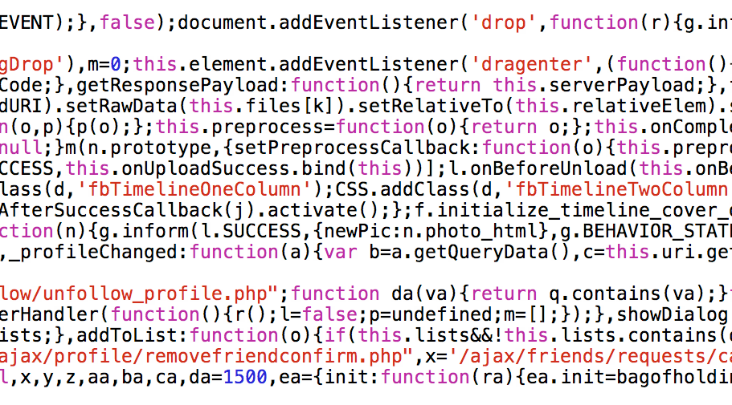
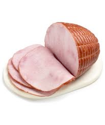
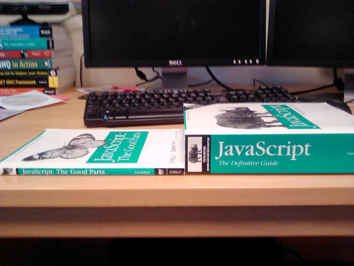

Title: JavaScript pour le développeur Java  
Author: Christophe Jollivet  
Date: Juillet 2013  


  


# Chritophe Jollivet
- Neurobiologiste
- Informaticien
- Homme de communauté
- @jollivetc


# Sondage


# Qui connait JavaScript ?


# Autrement qu’un copier-coller du web ?


## Les autres, qui se dit qu’il devrait apprendre JavaScript ?


# Pourquoi JavaScript ?


# Atwood Law
- «Any application that can be written in JavaScript, will ventually be written in JavaScript»
- http://www.codinghorror.com/blog/2007/07/the-principle-of-least-power.html


# Histoire
- TODO serie d'images à récupérer...


# Erreur ?!
- Erreur en ligne XXX
- Cela fait un moment que c’est le bazar mais là je ne m’en sors plus


# La révélation
- Projets en HTML 5
- De vrais développeurs JavaScript
- Des ateliers


# J'apprends JavaScript


  


TODO IMAGE CODE JS 2


TODO IMAGE CODE JS 3


TODO IMAGE CODE JS 4


- «*JavaScript is the only  
language that people feel they  
don’t need to learn to use it*»  
Doug Crockford


# Java is to JavaScript
## What ham is to hamster  

  


- http://blog.movereem.nl/images/javascript-the-good-parts-the-definitive-guide.jpg  



  
- http://jsbooks.revolunet.com/


  


# Tour de JavaScript


# Types


## Types
- Number, String, Boolean, undefined
- Object, function
- Faiblement typé


## Number
- 64 bits floating point
- IEEE-754 (aka Double)
- Ecriture littérale
- 1.024e+3 === 1024
- Méthodes (toExponential, toFixed, toPrecision...)


## valeurs approximatives
### (0.1 + 0.2) + 0.3 === 0.1 + (0.2 + 0.3)  
### Vrai ou Faux ?


# FAUX 
##(0.1 + 0.2) + 0.3 === 0.1 + (0.2 + 0.3)


## valeurs approximatives
### 9007199254740992 === 9007199254740992 + 1  
### Vrai ou Faux ?


# VRAI
### 9007199254740992 === 9007199254740992 + 1  


# Objet


# Objet
- Container de propriétés avec un nom et une valeur
- nom de propriété est une string y compris ""
- propriété est n’importe quelle valeur sauf undefined


## Déclaration objet
```javascript
var p1 = new Object();
p1.nom = "Dupont";
p1.sayHello = function(){
    consoloe.log("hello");
};
```


## Déclaration objet
```javascript
var p2 = {
    nom: "Dupont",
    sayHello: function(){
            console.log("hello");
    }
};
```


## Déclaration objet
TODO Animation sur le texte du code JavaScript !!


## Déclaration objet
TODO Animation sur le texte du code JavaScript !!
Illustration du this et new


## Accès aux valeurs
```javascript
var personne = {
    nom: "Dupont"
    };

console.log(personne.nom);
console.log(personne['nom']);

personne.nom = "durand";
personne['nom'] = "Durand";

delete personne.nom;
delete personne['nom'];
};
```


## Instropection
```javascript
var p2 = {
    nom: "Dupont",
    sayHello:function(){
        console.log("hello");
    }
};
var name = "nom";
var greets = "sayHello";

console.log(p2[name]);
p2[greets]();
```


# Objet et héritage


# Création d’objet
```javascript
function Rectangle(lo, la){
    this.longueur = lo;
    this.largeur = la;
    this.surface = function(){
        return this.longeur * this.largeur;
    }
}
var anotherRectangle = new Rectangle(15,20);
```


# Problème
TODO Récupérer les images de l'objet Rectangle


# Héritage par prototype
- Un objet hérite directement d’un autre objet, il n’y a pas de notion de classe.
- On place les propriétés communes dans le prototype pour la mémoire.


# Création d'objet
```javascript
function Rectangle(lo, la){
    this.longueur = lo;
    this.largeur = la;
}
Rectangle.prototype.surface = function(){
    return this.longeur * this.largeur;
};
```


# Solution
TODO récupérer les images des objets et de surface


# Extension
- Ajout d’une méthode dans un prototype
- la méthode est alors disponible pour toutes les instances existantes et à venir


# Résolution de propriété
- Se fait en remontant la chaîne de prototype
- Il est possible de surcharger une propriété


# For in
## itérateur sur les propriétés de l'objet
```javascript
for (propName in foo){
    console.log("property : " + propName);
}
```
Les propriétés du prototype sont ainsi listées.


hasOwnProperty  
TRUE si la propriété est à l’objet et pas au prototype  
```javascript
for (propName in foo){
    if (foo.hasOwnPropery(propName)) {
        console.log("property : " + propName);
    }
}
```
Attention si foo a une propriété ‘hasOwnProperty’


# Fonctions